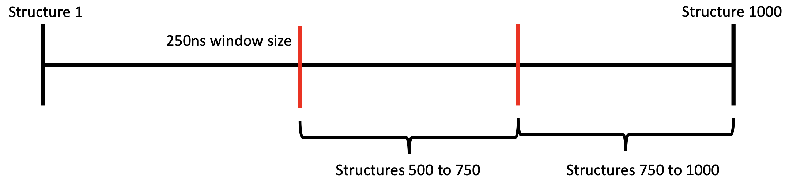

# Guide for Clustering an MD Trajectory And Convergence Check

## Step 1 Generate structures

1. Create a new directory and `cd` into it 

2. Run Amber `cpptraj` to generate structures
cpptraj script will look like this: 

```
parm topology_file
trajin trajectory_file
trajout struct pdb offset 100 multi
```

## Step 2 analyses

previos process will take a while then continue with the analyses:

We have a trajectory consists of structures and we need to split it for example 150ns windows:


After splitting we are going to create a new directory and copy the structures belonging to each window and cluster them:

```
cluster.py structures*.pdb --rmsd=1.0
```

## Step 3 more analyses

In the `cluster.py` script we can play with the rmsd value based on the protein system we are working on.

At this point we will have clusters form for two consecutive sections of the trajectory: 

`700 to 850` and `850 to 1000`

For both of them the cluster percentages needs to be checked. If the cluster percentages are very low, additional consideration is needed. (we can talk about that later)

If the cluster percentages are high enough we will continue with comparing the highest clusters from both winnows we clustered.

We will compare the highest percentage clusters with rmsd.py script. 

```
rmsd.py 700_850_clust01.pdb 850_1000_clust01.pdb
```

The output of the `cluster.py` script will provide us with an rmsd number.

## Step 4 even more analyses

After this point we are going to repeat the same clustering analyses with different windows taken on different parts of the trajectory as well as different window sizes. For example:




## Step 5 consolidate data

After repeating the analyses on multiple windows we can gather the data and assess the rmsd variations in an excel document as follows:

<p align="center" width="100%">
    
</p>

Example 1 is a good example showing rmsd values lower than 1 angstrom for many different window sizes for the last part of the simulation when applied.

<p align="center" width="100%">
    
</p>

Example 2 is a bad example considering the rmsd values
fluctuate over 1 angstrom for many different windows for the analyses

### Conclusion: 

In this example I analyzed simulations for two different mutants of the same protein system. One of the simulations show good convergence and I can use the window with the lowest rmd to calculate dfis. For the other simulation that doesn’t show convergence I would extend the simulation.

